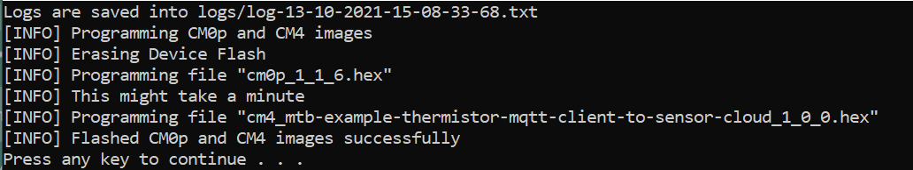
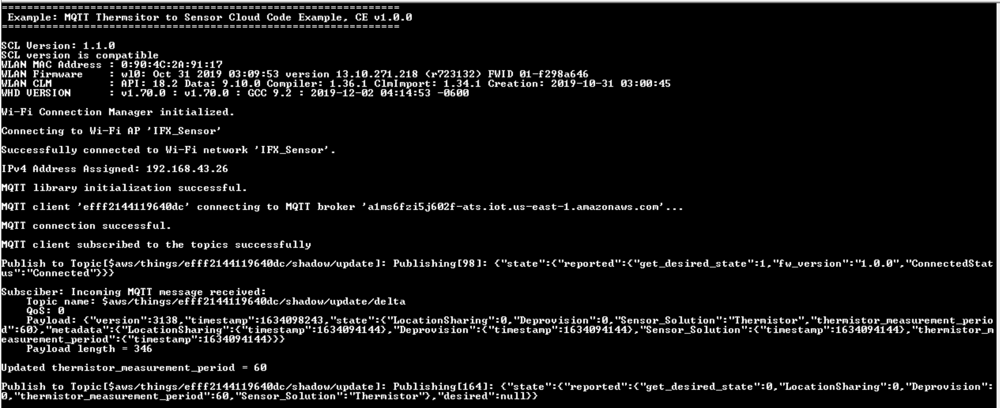
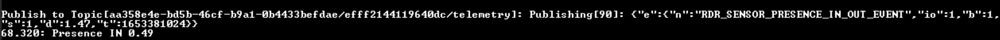
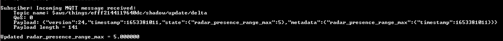
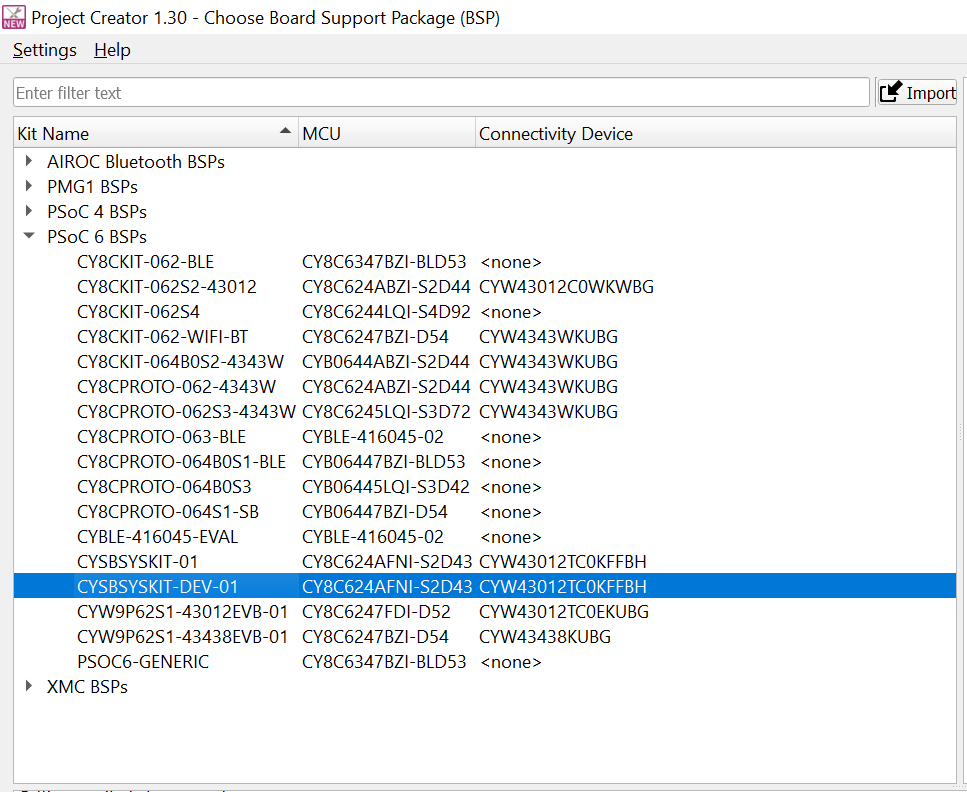
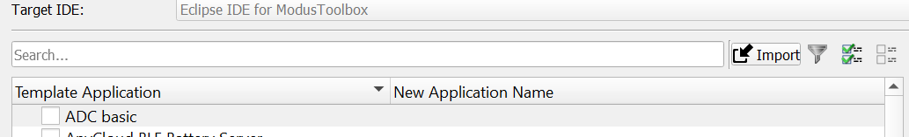
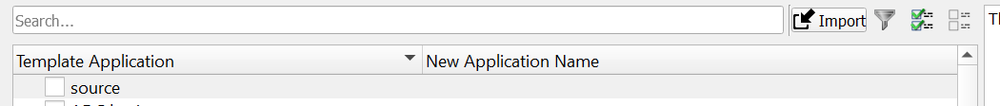
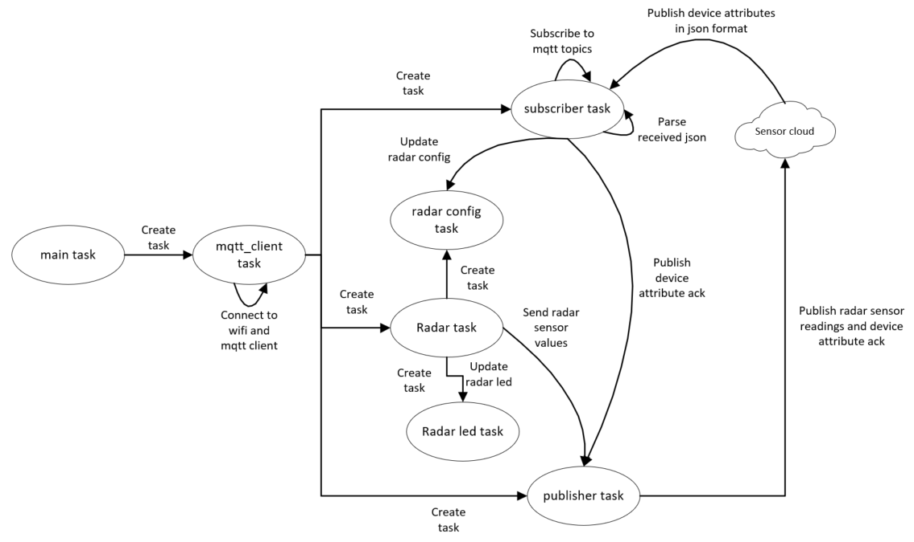

# AnyCloud: Radar Presence to Sensor Cloud

## Overview

This code example demonstrates radar presence solution to detect human presence using [Infineon XENSIV™ 60-GHz radar MMIC](https://www.infineon.com/cms/en/product/sensor/radar-sensors/radar-sensors-for-iot/60ghz-radar/). This solution provides extremely high accuracy in detecting both micro and macro motions. The ability to detect micro motion offers unique benefits over conventional technologies deployed to detect human presence, thus making it perfect for user interaction with devices.

**Sequence of operation**

1. On Powerup, the device connects to the cloud and publishes the firmware version in json format.

2. The cloud sends the device attributes configured in json format to the device.

3. The subscriber task parses the incoming message and configures radar sensor with received parameters.

4. When the radar sensor detects any movement in front of it, the range at which the presence is detected is sent to the psoc

5. Radar task reads the data and publishes it to sensor cloud

## Requirements

- [ModusToolbox&trade; software](https://www.cypress.com/products/modustoolbox-software-environment) v2.3 or later
- Board support package (BSP) minimum required version: 2.0.0
- Programming language: C
- Associated parts: All [PSoC&trade; 6 MCU](http://www.cypress.com/PSoC6) parts with SDIO, [PSoC™ 6 MCU with AIROC™ CYW43012 Wi-Fi & Bluetooth® combo chip](https://www.cypress.com/documentation/datasheets/cyw43012-single-chip-ultra-low-power-ieee-80211n-compliant-ieee-80211ac)

## Supported toolchains (make variable 'TOOLCHAIN')

- GNU Arm® embedded compiler v9.3.1 (`GCC_ARM`) - Default value of `TOOLCHAIN`

## Supported kits (make variable 'TARGET')

- Rapid IoT Connect Developer Kit (`CYSBSYSKIT-DEV-01`) - Default value of `TARGET`

## Hardware setup

This code example requires the XENSIV™ BGT60TR13C radar wing board as part of the connected sensor kit.

1. Connect the radar wing board to the CYSBSYSKIT-DEV-01 kit.

2. Connect the CYSBSYSKIT-DEV-01 kit to the PC with a USB cable.

3. Place the CYSBSYSKIT-DEV-01 kit at a fixed location (for example, the corner of a room) to ensure optimal performance of the presence detection application.

## Software setup

Install a terminal emulator if you don't have one. Instructions in this document use [Tera Term](https://ttssh2.osdn.jp/index.html.en).

This example requires no additional software or tools.

## Note for Apple Iphone hotspot creation:
Steps to follow, for creating a Hotspot consisting of apostrophe using iPhone: 

1. Go to settings -> Keyboard Settings -> Turn off the Smart punctuation option. 
2. Create a Hotspot consisting of Standard or Default Apostrophe. 

## Operation

1. Connect the board to your PC using the provided USB cable through the KitProg3 USB connector.

2. Open a terminal program and select the KitProg3 COM port. Set the serial port parameters to 8N1 and 115200 baud.

3. Program the auto-generated images to the board using *program_kit.cmd* provided in the download bundle
   
   a. Open the cmd prompt and navigate to the downloaded bundle.
   
   b. Double click on the *program_kit.cmd*
   
   c. You should see the image getting flashed as shown below.

      **Figure 1. Flashing the firmware**

      

   d. Click any key to close the command prompt

4. After programming, the application starts automatically. Observe the messages on the UART terminal, and wait for the device to make all the required connections.

   **Figure 2. Application initialization status**

   

5. After the device subscribes to the topics successfully, follow the kit user guide to change the device attributes from the sensor cloud UI if necessary. Default values will be used if no changes are done to attributes.

6. By default the device publishes temperature values every 60 seconds. 
   
   **Figure 3. Publish the sensor reading**

   

7. Change the attributes in cloud UI for changing the radar sensor configuration.

   **Figure 4. Attribute change on cloud**

   

8. For every attribute changed on the cloud the device outputs the following log to the terminal.

   **Figure 5. Attribute change message**

   

## Using the code example

Import the *source/* folder provided in the download bundle to one of the following:

<b>In Eclipse IDE for ModusToolbox</b>

1. Open Modustoolbox and select a workspace

2. Click the **New Application** link in the **Quick Panel** (or, use **File** > **New** > **ModusToolbox Application**). This launches the [Project Creator](http://www.cypress.com/ModusToolboxProjectCreator) tool.

3. Click PSoC 6 BSPs and select CYSBSYSKIT-DEV-01 from the list shown in the **Project Creator - Choose Board Support Package (BSP)** dialog.

   **Figure 6. Project Creator**

   

4. Click Next and click on the **import** button as shown below

   **Figure 7. Import custom application**

   
   

5. Select the *source/* folder from the downloaded bundle and click choose

   **Figure 8. select custom application**

   

6. Select the source as shown in the below image and click **Create** to complete the application creation process.

7. Wait for the dependent libraries to be downloaded. It might take a few minutes. 

For more details, see the [Eclipse IDE for ModusToolbox User Guide](https://www.cypress.com/MTBEclipseIDEUserGuide) (locally available at *{ModusToolbox install directory}/ide_{version}/docs/mt_ide_user_guide.pdf*).

<b>In command-line interface (CLI)</b>

Alternatively, you can manually create the application using the following steps:

1. Open a CLI terminal and navigate to the *source/* folder.

   On Windows, use the command line `modus-shell` program provided in the ModusToolbox installation instead of a standard Windows command line application. This shell provides access to all ModusToolbox tools. You can access it by typing `modus-shell` in the search box in the Windows menu.

   In Linux and macOS, you can use any terminal application.

   **Note:** The cloned application contains a default BSP file (*TARGET_xxx.mtb*) in the *deps* folder. Use the [Library Manager](https://www.cypress.com/ModusToolboxLibraryManager) (`make modlibs` command) to select and download a different BSP file, if required. If the selected kit does not have the required resources or is not [supported](#supported-kits-make-variable-target), the application may not work.

2. Import the required libraries by executing the `make getlibs` command.

Various CLI tools include a `-h` option that prints help information to the terminal screen about that tool. For more details, see the [ModusToolbox User Guide](https://www.cypress.com/ModusToolboxUserGuide) (locally available at *{ModusToolbox install directory}/docs_{version}/mtb_user_guide.pdf*).

<b>In Third-party IDEs</b>

1. Follow the instructions from the **In command-line interface (CLI)** section to create the application, and import the libraries using the `make getlibs` command.

2. Export the application to a supported IDE using the `make <ide>` command.

   For a list of supported IDEs and more details, see the "Exporting to IDEs" section of the [ModusToolbox User Guide](https://www.cypress.com/ModusToolboxUserGuide) (locally available at *{ModusToolbox install directory}/docs_{version}/mtb_user_guide.pdf*).

3. Follow the instructions displayed in the terminal to create or import the application as an IDE project.

After the import is successful follow the below steps to build the source 

1. Modify the user configuration files in the *configs* directory as follows:

      1. **Wi-Fi Configuration:** Set the Wi-Fi credentials in *configs/wifi_config.h*: Modify the macros `WIFI_SSID`, `WIFI_PASSWORD`, and `WIFI_SECURITY` to match with that of the Wi-Fi network that you want to connect.

      2. Other configuration files: You can optionally modify the configuration macros in the following files according to your application:
         - *configs/core_mqtt_config.h* used by the [MQTT library](https://github.com/Infineon/mqtt)

         - *configs/FreeRTOSConfig.h* used by the [FreeRTOS library](https://github.com/Infineon/freertos)

2. Build the source using the standard build method of respective IDEs

3. Program the *cm0p_{version}.hex* image to the board using program kit provided in the downloaded bundle:

   a. Open the cmd prompt and navigate to the downloaded bundle.
   
   b. Enter the below command
      
         program_kit.cmd cm0p
   
   c. This should flash the cm0p image

4. Build and program the code example using the build method for respective IDE
   
   

<b>In Eclipse IDE for ModusToolbox</b>

   
   1. Select the application project in the Project Explorer.
   
   2. In the **Quick Panel**, scroll down, and click **\<Application Name> Program (KitProg3_MiniProg4)**.
   
   

   

<b>In command-line interface (CLI)</b>

   1. Build and program by executing `make program` command.
   
   

### Sensor Information and LEDs
1. The radar task is suspended if the radar wing board is not connected to the feather kit. The sensor initialization process is indicated by blinking the red LED (CYBSP_USER_LED) on CYSBSYSKIT-DEV-01. The red LED (CYBSP_USER_LED) on CYSBSYSKIT-DEV-01 remains turned on when system is operational (ready state).

2. The LED on radar wing board indicates different events with different patterns as follows:

    **Table 1. Events and LED glow patterns**

   | LED pattern  |  Event type  |  Comment  |
   | ----------- | ----------- | -----    |
   | **Presence sensing** |
   | LED glows in red color | `MTB_RADAR_SENSING_EVENT_PRESENCE_IN` | Presence event detected. Entering field of view
   | LED stable in green color | `MTB_RADAR_SENSING_EVENT_PRESENCE_OUT` | Presence event detected. Leaving filed of view

### Configure parameters

You can configure the application parameters from sensor cloud
1. radar_presence_range_max :- The maximum radar detection range, which is the maximum range up to which the radar detects a target.

   Supported values: 0.66-10.2 m. Default value: 2 m
2. radar_presence_sensitivity range :- The change in sensitivity affects the speed of object detection.

   Supported values: "high", "medium", "low". Default value: "medium"

For details, see the [XENSIV™ RadarSensing API documentation](https://infineon.github.io/xensiv-radar-sensing/radarsensing_api_reference_manual/html/index.html).

## Debugging

You can debug the example to step through the code. In the IDE, use the **\<Application Name> Debug (KitProg3_MiniProg4)** configuration in the **Quick Panel**. For more details, see the "Program and debug" section in the [Eclipse IDE for ModusToolbox User Guide](https://www.cypress.com/MTBEclipseIDEUserGuide).

**Note:** **(Only while debugging)** some code in `main()` may execute before the debugger halts at the beginning of `main()`. This means that some code executes twice - once before the debugger stops execution, and again after the debugger resets the program counter to the beginning of `main()`. See [KBA231071](https://community.cypress.com/docs/DOC-21143) to learn about this and for the workaround.

## Design and implementation

This example implements six RTOS tasks: MQTT Client, Publisher, Subscriber, Radar task, Radar Config task and Radar Led task. The main function initializes the BSP and the retarget-io library, and creates the MQTT Client task.

The MQTT Client task initializes the Wi-Fi connection manager (WCM) and connects to a Wi-Fi access point (AP) using the Wi-Fi network credentials that are configured in *wifi_config.h*. Upon a successful Wi-Fi connection, the task initializes the MQTT library and establishes a connection with the Sensor Cloud.

The certificates required for the MQTT connection are provided in *configs/mqtt_client_certs.h*. These certificates are auto-generated when the device is provisioned in cloud.

After a successful MQTT connection, Publisher, Subscriber and Radar tasks are created. The MQTT Client task then waits for commands from the other two tasks and callbacks to handle events like unexpected disconnections.

An MQTT event callback function `mqtt_event_callback()` is invoked by the MQTT library for events like MQTT disconnection and incoming MQTT subscription messages from the MQTT broker. In the case of an MQTT disconnection, the MQTT client task is informed about the disconnection using a message queue. When an MQTT subscription message is received, the subscriber callback function implemented in *subscriber_task.c* is invoked to handle the incoming MQTT message.

The subscriber task subscribes to mqtt topics, registers a callback for JSON Parser and waits for the incoming messages. Upon receiving a message the JSON parser is started to parse the message and PUBLISH_DEVICE_PROPERTIES_UPDATE_ACK message is put into publisher task queue for publishing the acknowledgement message. The topic subscribed to 
   
   1. *aws/things/<-Kit ID->/shadow/update/delta*

The Radar task initializes radar sensor in entrance counter mode with default configuration parameters. It then creates radar led task and radar config task. Radar led task is used to maintain states of led on radar sensor depending on the events received. radar config task is used to configure the radar sensor whenever the device attributes on cloud are updated. 

The Publisher task starts and waits for messages from other tasks to publish firmware version, publish sensor readings or publish device properies acknowledgement. The following topics are used to publish respective messages :-
   
   1. *<-Tenant ID->/<-Kit ID->/telemetry*- publish sensor readings
   
   2. *aws/things/<-Kit ID->/shadow/update*- publish firmware version and device properies update acknowledgement

The MQTT client task handles unexpected disconnections in the MQTT or Wi-Fi connections by initiating reconnection to restore the Wi-Fi and/or MQTT connections. Upon failure, the Publisher, Subscriber and radar tasks are deleted, cleanup operations of various libraries are performed, and then the MQTT client task is terminated.

   **Figure 9. Design Diagram**

   

## Configuring the MQTT Client

### Wi-Fi and MQTT configuration macros

Please visit *configs/wifi_config.h*, *configs/mqtt_client_config.h* and *configs/mqtt_client_certs.h* for more information on configurable parameters

### Files included

**Table 2. Application source files**

|File name            |Comments         |
| ------------------------|-------------------- |
| *main.c* | Contains the application entry point. It initializes the UART for debugging and then initializes the controller tasks|
| *mqtt_client_config.c* | Global variables for MQTT connection|
| *mqtt_task.c* | Contains the task function to:   1. Establish an MQTT connection   2. Start Publisher and Subscriber tasks   3. Start the Thermistor task|
| *publisher_task.c* | Contains the task function to publish messages to the MQTT broker|
| *subscriber_task.c* | Contains the task function to subscribe messages from the MQTT broker|
| *radar_config_task.c* | Contains the task function to configure radar sensor|
| *radar_led_task.c* | Contains the task function to maintain led states on radar sensor|
| *radar_task.c* | Contains the task function to continuously poll and process any radar sensor messages |
| *device_properties.c* | Contains functions for parsing and publishing device properties |

### Resources and settings

**Table 3. Application resources**

| Resource  |  Alias/object     |    Purpose     |
| :-------- | :-------------    | :------------- |
| UART (HAL) | cy_retarget_io_uart_obj | UART HAL object used by Retarget IO for Debug UART port |
| GPIO (HAL) | LED_RGB_RED      | User LED to indicate the doorway state |
| GPIO (HAL) | LED_RGB_GREEN    | Wing Board LED to indicate the doorway state |
| SPI | mSPI | Communication with the radar hardware |

## Related resources

| Application notes                                            |                                                              |
| :----------------------------------------------------------- | :----------------------------------------------------------- |
| [AN228571](https://www.cypress.com/AN228571) – Getting started with PSoC&trade; 6 MCU on ModusToolbox | Describes PSoC&trade; 6 MCU devices and how to build your first application with ModusToolbox |
| [AN215656](https://www.cypress.com/AN215656) – PSoC&trade; 6 MCU: dual-CPU system design | Describes the dual-CPU architecture in PSoC&trade; 6 MCU, and shows how to build a simple dual-CPU design |
| **Code examples**                                            |                                                              |
| [Using ModusToolbox](https://github.com/Infineon/Code-Examples-for-ModusToolbox-Software) | [Using PSoC&trade; Creator](https://www.cypress.com/documentation/code-examples/psoc-6-mcu-code-examples) |
| **Device documentation**                                     |                                                              |
| [PSoC&trade; 6 MCU datasheets](https://www.cypress.com/search/all?f[0]=meta_type%3Atechnical_documents&f[1]=resource_meta_type%3A575&f[2]=field_related_products%3A114026) | [PSoC&trade; 6 technical reference manuals](https://www.cypress.com/search/all/PSoC%206%20Technical%20Reference%20Manual?f[0]=meta_type%3Atechnical_documents&f[1]=resource_meta_type%3A583) |
| **Development kits**                                         | Buy at www.cypress.com                                       |
| [CYSBSYSKIT-DEV-01](https://github.com/Infineon/TARGET_CYSBSYSKIT-DEV-01) Rapid IoT Connect Developer Kit |  |
| **Libraries**                                                |                                                              |
| PSoC&trade; 6 peripheral driver library (PDL) and docs  | [mtb-pdl-cat1](https://github.com/Infineon/mtb-pdl-cat1) on GitHub |
| Hardware abstraction layer (HAL) Library and docs    | [mtb-hal-cat1](https://github.com/Infineon/mtb-hal-cat1) on GitHub |
| Retarget IO - A utility library to retarget the standard input/output (STDIO) messages to a UART port | [retarget-io](https://github.com/Infineon/retarget-io) on GitHub |
| **Middleware**                                               |                                                              |
| MQTT Client library and documents                            | [mqtt](https://github.com/Infineon/mqtt) on GitHub |
| Wi-Fi connection manager (WCM) library and documents         | [wifi-connection-manager](https://github.com/Infineon/wifi-connection-manager) on GitHub |
| Subsystems Communication Layer (SCL) library and documents         | [scl](https://github.com/Infineon/scl) on GitHub |
| SCL MTB Integration library and documents         | [scl-mtb-integration](https://github.com/Infineon/scl-mtb-integration) on GitHub |
| Wi-Fi middleware core library and documents                  | [wifi-mw-core](https://github.com/Infineon/wifi-mw-core) on GitHub|
| FreeRTOS library and documents                               | [freeRTOS](https://github.com/Infineon/freertos) on GitHub |
| Links to all PSoC&trade; 6 MCU middleware                           | [psoc6-middleware](https://github.com/Infineon/modustoolbox-software) on GitHub |
| **Tools**                                                    |                                                              |
| [Eclipse IDE for ModusToolbox](https://www.cypress.com/modustoolbox) | The cross-platform, Eclipse-based IDE for IoT designers that supports application configuration and development targeting converged MCU and wireless systems. |

## Other resources

Cypress provides a wealth of data at www.cypress.com to help you select the right device, and quickly and effectively integrate it into your design.

For PSoC&trade; 6 MCU devices, see [How to design with PSoC&trade; 6 MCU - KBA223067](https://community.cypress.com/docs/DOC-14644) in the Cypress community.

## Document history

| Version | Description of Change |
| ------- | --------------------- |
| 1.0.0   | New code example      |

------

All other trademarks or registered trademarks referenced herein are the property of their respective owners.

-------------------------------------------------------------------------------

© Cypress Semiconductor Corporation, 2016-2021. This document is the property of Cypress Semiconductor Corporation, an Infineon Technologies company, and its affiliates ("Cypress").  This document, including any software or firmware included or referenced in this document ("Software"), is owned by Cypress under the intellectual property laws and treaties of the United States and other countries worldwide.  Cypress reserves all rights under such laws and treaties and does not, except as specifically stated in this paragraph, grant any license under its patents, copyrights, trademarks, or other intellectual property rights.  If the Software is not accompanied by a license agreement and you do not otherwise have a written agreement with Cypress governing the use of the Software, then Cypress hereby grants you a personal, non-exclusive, nontransferable license (without the right to sublicense) (1) under its copyright rights in the Software (a) for Software provided in source code form, to modify and reproduce the Software solely for use with Cypress hardware products, only internally within your organization, and (b) to distribute the Software in binary code form externally to end users (either directly or indirectly through resellers and distributors), solely for use on Cypress hardware product units, and (2) under those claims of Cypress’s patents that are infringed by the Software (as provided by Cypress, unmodified) to make, use, distribute, and import the Software solely for use with Cypress hardware products.  Any other use, reproduction, modification, translation, or compilation of the Software is prohibited.
 
TO THE EXTENT PERMITTED BY APPLICABLE LAW, CYPRESS MAKES NO WARRANTY OF ANY KIND, EXPRESS OR IMPLIED, WITH REGARD TO THIS DOCUMENT OR ANY SOFTWARE OR ACCOMPANYING HARDWARE, INCLUDING, BUT NOT LIMITED TO, THE IMPLIED WARRANTIES OF MERCHANTABILITY AND FITNESS FOR A PARTICULAR PURPOSE.  No computing device can be absolutely secure.  Therefore, despite security measures implemented in Cypress hardware or software products, Cypress shall have no liability arising out of any security breach, such as unauthorized access to or use of a Cypress product.  CYPRESS DOES NOT REPRESENT, WARRANT, OR GUARANTEE THAT CYPRESS PRODUCTS, OR SYSTEMS CREATED USING CYPRESS PRODUCTS, WILL BE FREE FROM CORRUPTION, ATTACK, VIRUSES, INTERFERENCE, HACKING, DATA LOSS OR THEFT, OR OTHER SECURITY INTRUSION (collectively, "Security Breach").  Cypress disclaims any liability relating to any Security Breach, and you shall and hereby do release Cypress from any claim, damage, or other liability arising from any Security Breach.  In addition, the products described in these materials may contain design defects or errors known as errata which may cause the product to deviate from published specifications.  To the extent permitted by applicable law, Cypress reserves the right to make changes to this document without further notice. Cypress does not assume any liability arising out of the application or use of any product or circuit described in this document.  Any information provided in this document, including any sample design information or programming code, is provided only for reference purposes.  It is the responsibility of the user of this document to properly design, program, and test the functionality and safety of any application made of this information and any resulting product.  "High-Risk Device" means any device or system whose failure could cause personal injury, death, or property damage.  Examples of High-Risk Devices are weapons, nuclear installations, surgical implants, and other medical devices.  "Critical Component" means any component of a High-Risk Device whose failure to perform can be reasonably expected to cause, directly or indirectly, the failure of the High-Risk Device, or to affect its safety or effectiveness.  Cypress is not liable, in whole or in part, and you shall and hereby do release Cypress from any claim, damage, or other liability arising from any use of a Cypress product as a Critical Component in a High-Risk Device.  You shall indemnify and hold Cypress, including its affiliates, and its directors, officers, employees, agents, distributors, and assigns harmless from and against all claims, costs, damages, and expenses, arising out of any claim, including claims for product liability, personal injury or death, or property damage arising from any use of a Cypress product as a Critical Component in a High-Risk Device.  Cypress products are not intended or authorized for use as a Critical Component in any High-Risk Device except to the limited extent that (i) Cypress’s published data sheet for the product explicitly states Cypress has qualified the product for use in a specific High-Risk Device, or (ii) Cypress has given you advance written authorization to use the product as a Critical Component in the specific High-Risk Device and you have signed a separate indemnification agreement.
 
Cypress, the Cypress logo, and combinations thereof, WICED, ModusToolBox, PSoC, CapSense, EZ-USB, F-RAM, and Traveo are trademarks or registered trademarks of Cypress or a subsidiary of Cypress in the United States or in other countries.  For a more complete list of Cypress trademarks, visit cypress.com.  Other names and brands may be claimed as property of their respective owners.
